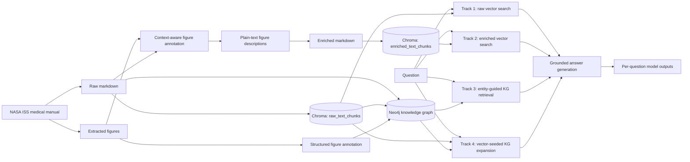

# Beyond Text: Multimodal RAG for Spaceflight Procedures

A research prototype for answering questions over NASA ISS medical procedure documents using four retrieval and generation pipelines: plain-text vector RAG, image-enriched vector RAG, knowledge-graph retrieval, and hybrid vector-plus-graph retrieval.

The project was developed for **TUM BPC Data Engineering, Summer Semester 2026 — Project 11: Multimodal RAG for Spaceflight Procedures**. Its central question is whether textual representations of figures and structured graph relationships preserve procedural context better than text-only retrieval.

> [!WARNING]
> This repository is an academic prototype. It is **not** a clinical decision-support system and must not be used for medical diagnosis, treatment, or real spaceflight operations. Generated answers can be incomplete or incorrect. Consult the official source procedures and qualified personnel.

## Contents

- [Project overview](#project-overview)
- [Retrieval tracks](#retrieval-tracks)
- [System architecture](#system-architecture)
- [Repository structure](#repository-structure)
- [Requirements](#requirements)
- [Installation](#installation)
- [Configuration](#configuration)
- [Build the data stores](#build-the-data-stores)
- [Run question answering](#run-question-answering)
- [Question format](#question-format)
- [Outputs](#outputs)
- [Troubleshooting](#troubleshooting)
- [Limitations and future work](#limitations-and-future-work)

## Project overview

Operational procedure documents are semi-structured and multimodal. Important information may appear in numbered steps, warnings, figures, visible labels, captions, and references between sections. A text-only RAG system can retrieve relevant prose while missing visual evidence or breaking a procedure across unrelated chunks.

This repository explores two complementary forms of enrichment:

1. **Textual multimodal enrichment:** a vision-language model converts figures into retrieval-oriented descriptions that are inserted into the markdown before embedding.
2. **Structured multimodal enrichment:** documents, chunks, steps, warnings, and figures are represented in Neo4j and connected through typed relationships. Figure nodes store generated captions, OCR text, and detected entities.

The bundled corpus contains selected emergency and dental procedures extracted from the **NASA ISS Medical Emergencies Manual (2016)**, together with their figures, raw markdown, enriched markdown, generated annotations, vector stores, and experiment outputs.

## Retrieval tracks

| Track | Pipeline | Retrieval strategy | Multimodal evidence |
|---|---|---|---|
| **1** | Plain-text vector RAG | Similarity search over raw markdown chunks in Chroma | Figure references may be present, but visual content is not represented |
| **2** | Enriched-markdown RAG | Similarity search over markdown containing generated figure descriptions; neighboring chunks are added around each hit | Figure descriptions are embedded as text |
| **3** | Knowledge-graph retrieval | LLM entity extraction, entity-to-node linking, then typed traversal from `Document`, `TextChunk`, `Step`, `Figure`, or `Warning` seeds | Figure captions, OCR text, entities, warnings, and step relations |
| **4** | Hybrid RAG + KG | Vector search selects `TextChunk` seeds, then Neo4j expands the local neighborhood | Linked steps, previous/next steps, figures, warnings, captions, OCR, and entities |

All four generation scripts use a shared grounding policy: answers should rely only on retrieved context, preserve exact procedural details, and explicitly report insufficient evidence rather than invent missing steps or figure content.

## System architecture



### Knowledge-graph schema

The graph is built around the following node labels:

- `Document`
- `TextChunk`
- `Step`
- `Figure`
- `Warning`

Important relationships include:

- `Document-[:HAS_CHUNK]->TextChunk`
- `Document-[:HAS_STEP]->Step`
- `Document-[:HAS_FIGURE]->Figure`
- `Document-[:HAS_WARNING]->Warning`
- `TextChunk-[:BELONGS_TO]->Step`
- `TextChunk-[:MENTIONS]->Figure`
- `Step-[:HAS_FIGURE]->Figure`
- `Step-[:HAS_WARNING]->Warning`
- `Step-[:NEXT_STEP]->Step`
- `Document-[:RELATED_TO]->Document`
- `Warning-[:WARNS_ABOUT]->Figure`

## Repository structure

```text
.
├── config/
│   ├── .env                     # local API and Neo4j configuration; do not commit
│   ├── models.py                # lists models exposed by the configured API
│   └── models.txt               # model notes used during experimentation
├── data/
│   ├── pdfs/                    # source procedural PDF
│   ├── raw_markdown/            # text-only procedure documents
│   ├── enriched_markdown/       # markdown with inserted figure descriptions
│   ├── images/                  # extracted procedure figures
│   ├── chroma_baseline/         # persisted Track 1 vector store
│   ├── chroma_enriched/         # persisted Track 2 vector store
│   └── results/                 # annotations and generation outputs
├── notebooks/
│   └── demo_presentation.ipynb  # exploratory presentation notebook
├── src/
│   ├── ingestion/
│   │   ├── annotate_context.py  # figure descriptions using image + document context
│   │   ├── enrich_markdown.py   # inserts descriptions into markdown
│   │   ├── build_vector_store.py
│   │   ├── build_kg.py
│   │   ├── annotate_kg.py       # caption/OCR/entities stored on Figure nodes
│   │   └── add_relationships.py
│   ├── retrieval/
│   │   ├── search_text.py
│   │   ├── search_enriched.py
│   │   ├── search_kg.py
│   │   └── search_hybrid.py
│   └── generation/
│       ├── generate_text.py
│       ├── generate_enriched.py
│       ├── generate_kg.py
│       ├── generate_hybrid.py
│       ├── evaluate.py          # orchestrates models, questions, and tracks
│       └── questions.json
├── direct_chunks.py             # utility for inspecting/dumping Chroma chunks
└── requirements.txt
```

## Requirements

- Python **3.10+**; Python 3.11 or 3.12 is recommended
- A running **Neo4j 5.x** instance for Tracks 3 and 4
- An **OpenAI-compatible API endpoint** for answer generation and entity extraction
- A vision-capable model for `annotate_context.py` and `annotate_kg.py`
- Internet access on the first run if the Sentence Transformers embedding model is not cached locally

Tracks 1 and 2 can run without Neo4j after their Chroma stores have been built. Tracks 3 and 4 require Neo4j.

## Installation

Run all commands from the repository root.

```bash
git clone <repository-url>
cd space_procedure_multimodal_rag

python -m venv .venv
```

Activate the environment:

```bash
# Linux/macOS
source .venv/bin/activate

# Windows PowerShell
.venv\Scripts\Activate.ps1
```

Install dependencies:

```bash
python -m pip install --upgrade pip
pip install -r requirements.txt
```

### Optional: start Neo4j with Docker

```bash
docker run --name multimodal-rag-neo4j \
  -p 7474:7474 -p 7687:7687 \
  -e NEO4J_AUTH=neo4j/change-me \
  -d neo4j:5
```

Use the same username and password in `config/.env`.

## Configuration

Create `config/.env` with the following variables:

```dotenv
# OpenAI-compatible endpoint used for generation, entity extraction, and VLM calls
SAIA_API_KEY=your_api_key
SAIA_BASE_URL=https://your-openai-compatible-endpoint/v1
SAIA_DEFAULT_MODEL=your_default_model

# Neo4j connection
NEO4J_URI=bolt://127.0.0.1:7687
NEO4J_USER=neo4j
NEO4J_PASSWORD=change-me

# Optional: print detailed Track 3 entity-linking diagnostics
RAG_VERBOSE=0
```

`SAIA_DEFAULT_MODEL` is used by the individual scripts. The evaluator can override the answer-generation model list with `--models`.

> [!IMPORTANT]
> Never commit real credentials. Keep `config/.env` local. If a real key has previously been committed or shared, remove it from Git history and rotate it.

## Build the data stores

The repository includes generated artifacts, but the following sequence rebuilds the complete pipeline from source data.

### 1. Generate context-aware figure descriptions

This script sends each image together with its associated procedure context to a vision-language model. It appends one description per image and skips images that already exist in the output file.

```bash
python src/ingestion/annotate_context.py
```

Output:

```text
data/results/annotations/<model_name>/annotations.txt
```

The selected model must support image input.

### 2. Insert figure descriptions into markdown

Pass the annotation file explicitly so the intended model is used:

```bash
python src/ingestion/enrich_markdown.py \
  --annotations data/results/annotations/<model_name>/annotations.txt
```

Output:

```text
data/enriched_markdown/*.md
```

Each matched image reference is followed by a block beginning with `[Figure description]`.

### 3. Build both Chroma vector stores

```bash
python src/ingestion/build_vector_store.py
```

The script uses:

- embedding model: `sentence-transformers/all-MiniLM-L6-v2`
- chunk size: `500` characters
- chunk overlap: `50` characters
- collections: `raw_text_chunks` and `enriched_text_chunks`

Outputs:

```text
data/chroma_baseline/
data/chroma_enriched/
```

### 4. Build the Neo4j knowledge graph

The baseline Chroma collection must already exist because `build_kg.py` copies the aligned chunk IDs and texts into `TextChunk` nodes.

```bash
python src/ingestion/build_kg.py
```

This creates the initial document, step, warning, figure, and chunk nodes.

### 5. Add structured figure annotations to Neo4j

```bash
python src/ingestion/annotate_kg.py
```

For each unannotated `Figure`, the VLM generates:

- `caption`
- `ocr_text`
- `entities`

The values are stored directly on the figure node.

### 6. Add graph relationships

```bash
python src/ingestion/add_relationships.py
```

This adds sequential step links, chunk-to-step links, chunk-to-figure mentions, cross-document references, and warning-to-figure links.

## Run question answering

### Run one track

```bash
# Track 1: plain-text vector RAG
python src/generation/generate_text.py --top-k 5

# Track 2: enriched-markdown vector RAG
python src/generation/generate_enriched.py --top-k 5

# Track 3: entity-guided knowledge-graph retrieval
python src/generation/generate_kg.py --top-k 5

# Track 4: hybrid vector + graph retrieval
python src/generation/generate_hybrid.py --top-k 5
```

Use another question file with:

```bash
python src/generation/generate_hybrid.py \
  --questions path/to/questions.json \
  --top-k 5
```

### Run a comparison across tracks and models

`evaluate.py` is the recommended entry point for benchmark generation. It reuses each track's own retrieval and prompting logic, then writes one file per question and model containing all selected track answers.

```bash
python src/generation/evaluate.py \
  --questions src/generation/questions.json \
  --models medgemma-27b-it \
           deepseek-r1-distill-llama-70b \
           qwen3.5-122b-a10b \
           openai-gpt-oss-120b \
  --tracks 1 2 3 4 \
  --top-k 5 \
  --call-delay 5
```

Useful options:

| Option | Meaning |
|---|---|
| `--questions PATH` | Question JSON file; defaults to `src/generation/questions.json` |
| `--models MODEL ...` | Models to compare |
| `--tracks 1 2 3 4` | Subset of retrieval tracks |
| `--top-k N` | Number of vector hits or KG seed nodes |
| `--call-delay SECONDS` | Delay after each track call to reduce rate-limit errors |

## Question format

Question files contain a JSON array. Every object must include `id` and `question`; `category` is recommended because it controls the output folder.

```json
[
  {
    "id": "figure_q01",
    "category": "figure_description",
    "question": "Which labeled end of the EpiPen is placed against the outer thigh?"
  },
  {
    "id": "steps_q01",
    "category": "steps",
    "question": "What steps should be followed when medication does not flow through the intraosseous needle?"
  }
]
```

Use unique IDs and filesystem-safe category names.

## Outputs

### Evaluator output

```text
data/results/<category>/<question_id>/<model_name>.txt
```

Each file contains:

- model and question metadata
- the selected tracks
- number of retrieved source documents
- one generated answer per track

### Individual track output

When a `generate_*.py` script is run directly, it writes an aggregate file under a track-specific directory, for example:

```text
data/results/<question_file_stem>/track1/<model_name>/results.txt
data/results/<question_file_stem>/track2_enriched/<model_name>/results.txt
data/results/<question_file_stem>/track3_kg/<model_name>/results.txt
data/results/<question_file_stem>/track4_hybrid/<model_name>/results.txt
```

### Annotation output

```text
data/results/annotations/<model_name>/annotations.txt
```

Existing files under `data/results/` also include outputs from earlier experiments and question-category layouts.

## Inspect retrieved chunks

`direct_chunks.py` can dump a Chroma collection to JSON for manual quality inspection. Set the desired persistence directory and collection name inside the script, then run:

```bash
python direct_chunks.py
```

Typical combinations are:

| Store | Directory | Collection |
|---|---|---|
| Raw | `data/chroma_baseline` | `raw_text_chunks` |
| Enriched | `data/chroma_enriched` | `enriched_text_chunks` |

## Troubleshooting

### Chroma collection not found

Run the vector-store builder from the repository root:

```bash
python src/ingestion/build_vector_store.py
```

If the markdown, chunking configuration, or embedding model changed, remove the old Chroma directories and rebuild them to avoid stale IDs and embeddings.

### Neo4j connection failure

Confirm that Neo4j is running, port `7687` is reachable, and the URI and credentials in `config/.env` match the server.

### Tracks 3 or 4 return little context

Rebuild the graph in order:

```bash
python src/ingestion/build_kg.py
python src/ingestion/annotate_kg.py
python src/ingestion/add_relationships.py
```

Set `RAG_VERBOSE=1` to inspect Track 3 entity extraction, vocabulary linking, seed selection, and traversal.

### Figure descriptions are missing from Track 2

Confirm that:

1. the intended annotation file was passed to `enrich_markdown.py`;
2. `[Figure description]` blocks exist in `data/enriched_markdown/`;
3. `data/chroma_enriched/` was rebuilt after enrichment.

### Image annotation calls fail

Check that the configured model supports multimodal chat input and that the API accepts base64 data URLs. The two annotation scripts resize images to a maximum of 800 × 800 pixels before sending them.

### Rate-limit or timeout errors

The generation scripts retry common transient API failures with increasing delays. For larger benchmark runs, increase `--call-delay` and reduce the number of models or tracks per run.

## Limitations and future work

- Figure understanding is converted to text; the answer-generation stage does not directly inspect the original image.
- VLM annotations can contain OCR errors, omissions, or hallucinated relationships.
- Markdown parsing relies on regular expressions and may not capture every step, warning, or figure layout.
- `BELONGS_TO`, `MENTIONS`, and cross-document links use heuristic matching.
- Track 3 uses an LLM for entity extraction, which adds latency and may introduce unstable query terms.
- The current evaluator generates comparable answer files but does not implement final automatic scoring in `src/evaluation/`.
- The system is batch-oriented and does not yet provide a conversational interface with dialogue history.

Possible extensions include retrieval-aware annotation, stronger step-boundary preservation, graph reranking, multimodal answer generation over original figures, provenance citations, automated retrieval and answer metrics, and conversational follow-up questions.

## References

- NASA. *International Space Station Medical Emergencies Manual*. 2016.


## License and data use

