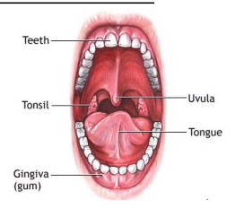
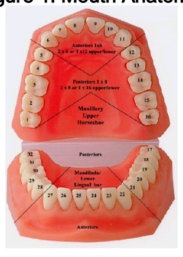
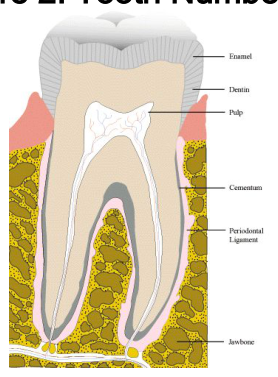

2.6.001 MOUTH ANATOMY
(ISS MED/E27 - ALL/FIN)
Page 1 of 1 page

OBJECTIVE:
Demonstrate anatomy of mouth and teeth.

1. IDENTIFYING ANATOMIC LANDMARKS

> **[Figure description]** An anatomical illustration of an open human mouth, labeled as Figure 1. Mouth Anatomy. The image identifies several key anatomic landmarks with leader lines pointing to specific body parts: "Teeth" at the top, "Tonsil" on the left side of the throat, "Uvula" hanging in the center of the throat, "Tongue" in the center foreground, and "Gingiva (gum)" at the bottom. The illustration shows the interior of the oral cavity, including the upper and lower dental arches and the soft palate. This image serves to demonstrate mouth anatomy as part of a medical procedure document.

Figure 1. Mouth Anatomy.

> **[Figure description]** An anatomical model of human upper and lower jaws and teeth, used to demonstrate mouth anatomy and tooth numbering.

The top portion of the model shows the maxillary (upper) jaw, labeled "Maxillary Upper Horseshoe." The teeth are numbered 1 through 16. A central section is labeled "Anteriors 1x6" with the note "2 x 6 or 1 x 12 upper/lower." The side sections are labeled "Posteriors 1 x 8" with the note "2 x 8 or 1 x 16 upper/lower."

The bottom portion of the model shows the mandibular (lower) jaw, labeled "Mandibular Lower Lingual bar." The teeth are numbered 17 through 32. The front section is labeled "Anteriors" and the back section is labeled "Posteriors."

The image serves as a visual guide for identifying anatomic landmarks and the numbering system for teeth.

Figure 2. Tooth Numbering.

> **[Figure description]** A medical diagram illustrating the anatomy of a tooth, labeled as Figure 3 in the document. The image shows a cross-section of a tooth embedded in the jawbone.

The diagram includes the following labeled anatomical components:
- Enamel: The outermost white layer covering the crown of the tooth.
- Dentin: The layer beneath the enamel, making up the bulk of the tooth.
- Pulp: The central core of the tooth containing blood vessels and nerves.
- Cementum: The layer covering the root of the tooth.
- Periodontal Ligament: The thin tissue layer between the cementum and the jawbone.
- Jawbone: The porous, yellow-brown bone structure surrounding the tooth root.

The image serves to identify the internal and external anatomic landmarks of a tooth for medical training purposes.

Figure 3. Tooth Anatomy.

04 MAR 11
2.6.001_M_22968.xml
