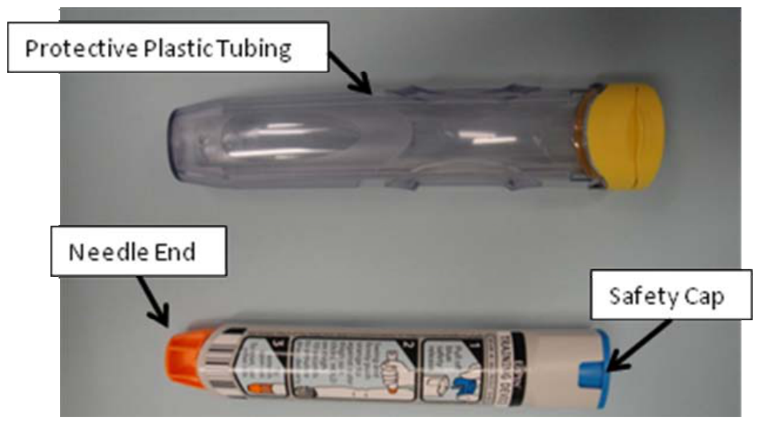
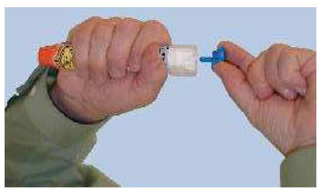
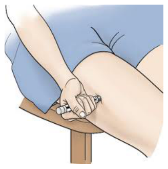

1.101 SEVERE ALLERGIC REACTION
(MED CL/HTV5 - ALL/FIN 2/Paper on ISS/T)
Page 1 of 2 pages

OBJECTIVE:
To rapidly treat a severe allergic reaction.

ITEMS:
Gray Tape
Emergency Medical Treatment Pack (Red):
Epinephrine (EpiPen)

1. DEPLOYING AND USING EPINEPHRINE (EPIPEN)
1.1 Remove Epinephrine (EpiPen) from protective plastic tubing.
(Figure 1)

Figure 1.- Epinephrine (EpiPen).

1.2 Form a fist around Epinephrine (EpiPen) with thumb closest to safety cap.

1.3 Activate auto injector by pulling off safety cap.
(Figure 2)

WARNING
1. Do not put fingers over needle end of Epinephrine (EpiPen) to
prevent injection into finger.
2. Do not give shot through clothing to prevent needle contamination.

23 MAR 15
1.101_M_22808.doc

1.101 SEVERE ALLERGIC REACTION
(MED CL/HTV5 - ALL/FIN 2/Paper on ISS/T)
Page 2 of 2 pages

Figure 2.- Activating Epinephrine (EpiPen).

1.4 Using a jabbing motion, press the needle end perpendicular to and firmly
against patient's outer thigh until a click is heard or felt.
Hold firmly against thigh for 10 seconds.
(Figure 3)

Figure 3.- Positioning of Epinephrine (EpiPen).

1.5 Discard used Epinephrine (EpiPen) in original protective plastic tubing;
secure in tube with Gray Tape and discard.
Call MCC-H to request PMC.

1.6 Epinephrine (EpiPen) may be repeated every 20 minutes if symptoms recur
or progress.

2. Go to 2.0.403 ALLERGIC REACTION, all (SODF: MED CL: EXAMS,
PROCEDURES, AND TREATMENT).

23 MAR 15
1.101_M_22808.doc