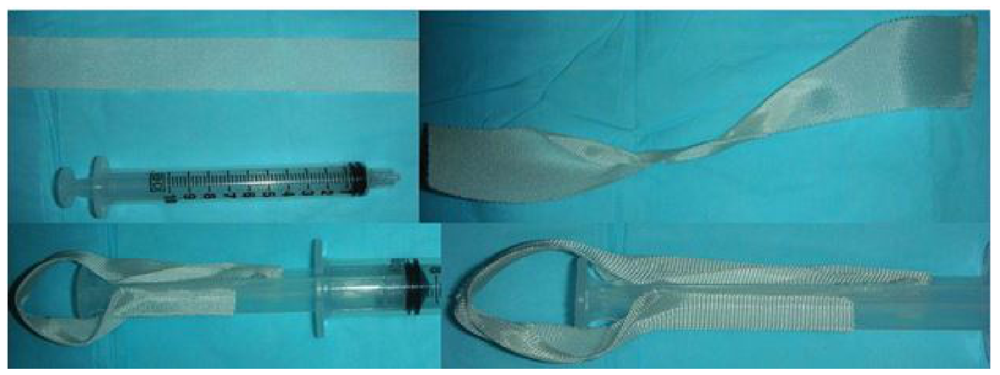
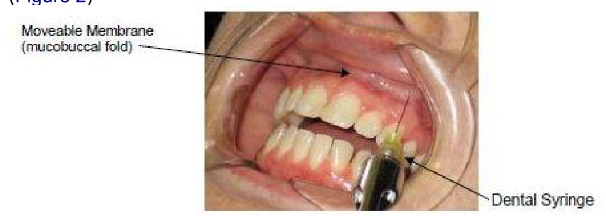
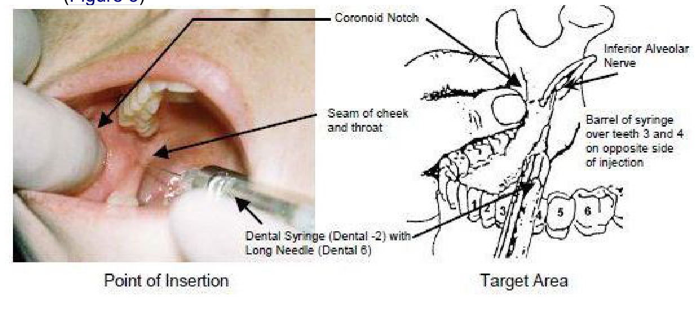

2.6.301 DENTAL PROCEDURE - NERVE BLOCK
(MED CL/SpX-6 - ALL/FIN 1/T)
Page 1 of 3 pages

OBJECTIVE:
To place a nerve block for dental procedures.

ITEMS:
LED Head Lamp P/N SEZ33103989-301
Medical Supply Pack (Green):
Gauze 4"x4"
Medical Tape
Needle 25G
Nitrile Gloves (select appropriate size)
Syringe 10 mL
Minor Treatment Pack (Pink):
Sharps Container
Topical & Injectable Medication Pack (Brown):
Benzocaine Swabstick
Lidocaine (Xylocaine)

1. PREPARING A WORKSPACE
Create workstation using Gray Tape and temporarily stow hardware on tape.
Use Ziplock Bag for trash stowage during procedure.

2. Place a Benzocaine Swabstick topical numbing stick on injection site [Topical &
Injectable Medication Pack (Brown)].
Leave in place for 5 to 10 minutes prior to injections.

3. CONFIGURING SYRINGE FOR DENTAL INJECTION

NOTE
1. A standard Syringe 10 mL will be modified to allow for one-handed aspiration (or
pulling back on plunger).
2. Aspiration allows operator to make sure the needle is not in a blood vessel.

3.1 Tear off an 8-inch strip of Medical Tape [Medical Supply Pack (Green)].
Twist the middle of the tape around itself.
Pull plunger out of syringe.
Apply the ends of the tape to the plunger.
(Figure 1)

15 APR 15
2.6.301_M_22895.xml

2.6.301 DENTAL PROCEDURE - NERVE BLOCK
(MED CL/SpX-6 - ALL/FIN 1/T)
Page 2 of 3 pages

Figure 1. Modification to Make Aspirating Syringe.

3.2 Draw up 10 mL of Lidocaine (Xylocaine) into Syringe 10 mL.
If required, refer to 2.14.303 INJECTIONS AND IV - DRAWING UP MEDICINE
FROM VIAL, all (SODF: MED CL: EXAMS, PROCEDURES, AND TREATMENT).

4. PREPARING PATIENT
Don Nitrile Gloves and LED Headlamp for adequate lighting.
Pack Gauze 4"x4" between gum and teeth to assist in visualizing injection location.

5. SELECTING INJECTION LOCATION
If using upper nerve block
Go to step 5.1.

If using lower nerve block
Go to step 5.2.

5.1 Upper Injection Technique
Needle 25G →|← Syringe 10 mL
Remove needle cap and temporarily stow on workspace.
Place needle at height of moveable membrane (muccobuccal fold) above fixed
gum tissue.
(Figure 2)

Figure 2. Upper Nerve Block.
Insert needle, directing needle toward root of tooth to be anesthetized.
Gently pull back on syringe plunger and inspect chamber to ensure no blood in
chamber.
Inject 2 to 3 mL of Lidocaine (Xylocaine) directly over the root of the tooth.
Withdraw needle; recap it using one-handed technique and temporarily stow.

15 APR 15
2.6.301_M_22895.xml

2.6.301 DENTAL PROCEDURE - NERVE BLOCK
(MED CL/SpX-6 - ALL/FIN 1/T)
Page 3 of 3 pages

Wait 5 minutes. Pain should subside.
If pain does not subside
Repeat step 5.1.

5.2 Lower Injection Technique
Needle 25G →|← Syringe 10 mL
Remove needle cap and temporarily stow.
Place thumb in deepest portion of coronoid notch.
(Figure 3)

Figure 3. Lower Nerve Block.
Insert needle just anterior at point where seam between cheek and throat turns
upward toward maxilla.
(Figure 3)

NOTE
Barrel of syringe is kept over teeth 3 and 4 on opposite side of injection.

Insert needle until bone is contacted (and only 5 to 10 mm of needle is left
exposed.)
If no bone contact
Withdraw needle slightly, reposition needle with syringe barrel over teeth 4
and 5.

If bone is contacted and more than 5 to 10 mm of needle exposed
Reposition needle with syringe barrel over teeth 2 and 3.

Gently pull back on syringe plunger and inspect chamber to ensure no blood in
chamber.
Inject 2 to 3 mL of Lidocaine (Xylocaine) directly over the root of the tooth.
Withdraw needle; recap it using one-handed technique and temporarily stow.
Wait 5 minutes. Pain should subside.
If pain does not subside
Repeat step 5.2.

Place used hardware, contaminated gloves, and packaging materials in Ziplock Bag
and discard.

15 APR 15
2.6.301_M_22895.xml
